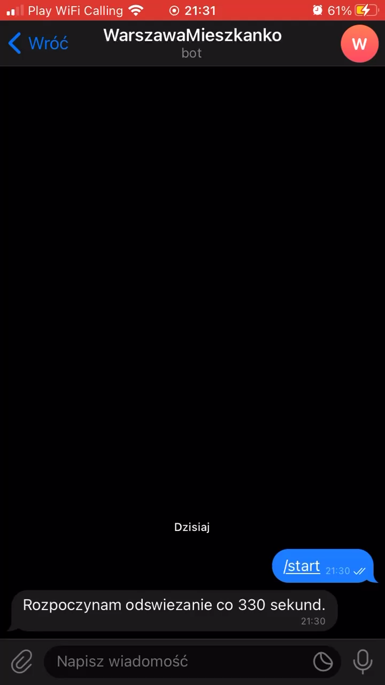
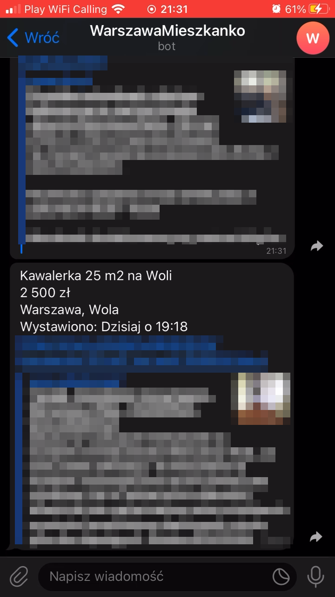
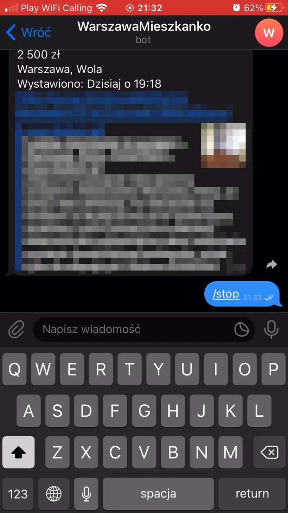

# Python Telegram flat scraper
*Olx website scraper built using Python, and the Telegram bot API.*

Features:
- Saves the last time it was ran and sends notifications about new posts compared to the last date
- Start command
- Stop command
- Autorun script for hosting

To use you need to [create a new bot](https://core.telegram.org/bots#6-botfather) and insert its api key in `bot_api_key` inside the `config.py` file.

### Here is a demo of how it works in action :)
It is in Polish as it is based on a Polish site but it should work with small tweaks on an English language site

1 | 2 | 3
:-------------------------:|:-------------------------:|:-------------------------:
 |  | 
